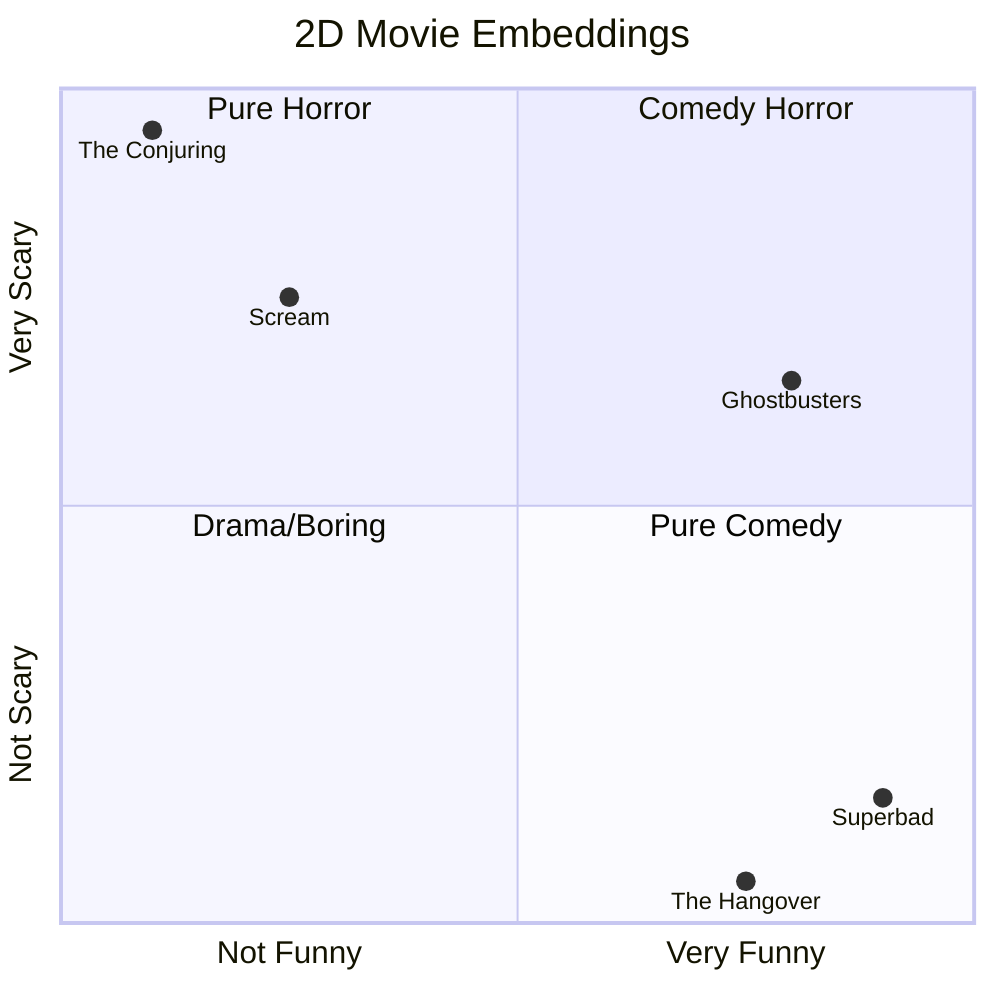

In [**Part 2** of this series](/mobile-infra-blog/llms-from-scratch-part-2-tokenization/), we built a Byte Pair Encoding Tokenizer. We learned that an LLM slices English text into chunks and assigns each chunk an integer ID. 

But there is a massive conceptual problem here. That Token ID is literally just the array index (the row number) where the token is saved in the vocabulary list. 

If the token for "cat" is saved at index `304`, and the token for "kitten" is saved at index `589`, the computer just sees two completely unrelated integers. An array index has absolutely no semantic meaning. **So, how does a computer understand that these two numbers represent similar concepts?**

To solve this, we have to teach the computer what words actually *mean*.

## Distributional Semantics

In 1957, a linguist named J.R. Firth coined a phrase that would eventually become the foundation of modern AI:

> *"You shall know a word by the company it keeps."*

If you read the sentence: *"The chef poured the rich, hot \_\_\_\_\_ into a mug,"* you can easily guess the missing word is something like *coffee*, *tea*, or *cocoa*. You know this because those words frequently keep company with "pour," "hot," and "mug." You would never guess *cement* or *shoes*.

This concept is called **Distributional Semantics**. Words that appear in similar contexts have similar meanings. If we can map out the context of every word in the English language, we can mathematically graph their meanings.

But how do you graph a "meaning"?

## The "Movie Rating" Analogy

Before we look at the complex math inside ChatGPT, let's step back and look at something familiar: rating movies.

Imagine you want to mathematically plot how similar three movies are. You decide to score them from `0.0` to `1.0` on exactly two categories (axes): **How Funny?** (X-Axis) and **How Scary?** (Y-Axis).

* ***The Conjuring***: It's not funny at all, but terrifying. Score: `[0.1, 0.9]`
* ***Superbad***: It's hilarious, but not scary. Score: `[0.9, 0.1]`
* ***Ghostbusters***: It's pretty funny and somewhat spooky. Score: `[0.8, 0.65]`

If you draw an X-axis and a Y-axis on a piece of paper and plot those scores, you have just created a **Vector Space**. 

If you mapped *Scream*, it would land very close to *The Conjuring*. If you mapped *The Hangover*, it would land next to *Superbad*. By simply scoring items on abstract "vibes", similar concepts naturally cluster together in space! 

If you added a third category—**How Romantic?**—you would need a 3-Dimensional graph. You are now plotting movies in 3D space using an array of 3 numbers (e.g. `[0.9, 0.0, 0.8]`).

## From Movies to Words (Embeddings)

An **Embedding** is exactly this movie rating system, but applied to the English language. 

Instead of an integer ID like `304`, a neural network represents a word as an array of floating-point numbers. In Kotlin, this is just a `DoubleArray`. 

Instead of rating words on just "Funny" and "Scary," the model uses thousands of invisible "vibes". **GPT-4 uses 12,288 invisible vibes to score every single word.** 

> [!NOTE]
> **How do you visualize 12,288 dimensions?** 
> You can't! The human brain is physically incapable of visualizing anything above 3 dimensions. When asked how to imagine higher dimensions, Geoffrey Hinton (the "Godfather of AI") famously joked: *"To deal with a 14-dimensional space, visualize a 3-D space and say 'fourteen' to yourself very loudly."* We just have to trust the math. The exact same Cosine Similarity geometry that works on a 2D piece of paper scales flawlessly up to 12,288 dimensions.

But here is the mind-blowing part: **No human programmer ever selects these vibes!** 

In Part 1, we learned about Backpropagation. The model starts by assigning 12,288 completely random numbers to every word. 

Let's look at a concrete example. Imagine the network reads: *"The king sat on his ___"*. 
Because its embeddings are currently random garbage, it guesses *"banana"*. The correct answer was *"throne"*. 

The Backpropagation algorithm looks at that mistake and asks: *"How should I nudge the numbers for the word 'king' so that next time, the math outputs 'throne' instead of 'banana'?"* 

It nudges the vector for `king` slightly. Later, it reads *"The queen sat on her ___"* and has to nudge the vector for `queen` so that it also predicts words like *"throne"* or *"crown"*. 

Because `king` and `queen` are constantly being mathematically pushed in the exact same direction to predict the exact same types of words, they end up physically clustered together in the vector space! The computer has absolutely no idea what "Royalty" or "Masculinity" is. It just knows *"these tokens predict crowns."* Human researchers only look at the math *after the fact* and realize, "Oh wow, dimension 42 seems to correlate with Royalty!"

> [!NOTE]
> **This is why AI needs GPUs!** Calculating these "nudges" requires massive amounts of matrix multiplication. A CPU is like a very smart professor who can solve one complex equation at a time. A GPU is like an army of 10,000 middle-schoolers who can all do basic multiplication simultaneously. To nudge 12,288 dimensions across billions of words, you need the army.

When GPT-4 sees the word "King," it plots it on a massive 12,288-dimensional graph!

## The Math: Cosine Similarity

Once we have plotted all our words as arrows pointing into space, how do we measure how similar two words are? We use a mathematical formula called **Cosine Similarity**. 

Despite the intimidating name, Cosine Similarity is simply asking one question: *"Are these two arrows pointing in the exact same direction on our graph?"*

* If they point the exact same way (angle = 0°), the similarity is **`1.0`** (a perfect semantic match).
* If they point at a right angle (90°), the similarity is **`0.0`** (completely unrelated concepts).
* If they point in exact opposite directions (180°), the similarity is **`-1.0`** (exact antonyms).

## Vector Arithmetic (The Magic Trick)

If words are just `DoubleArrays` representing scores, we can actually do standard math on them to solve analogies! The most famous example in AI is: **King - Man + Woman = ?**

Let's break down the logic using our 3 axes: `[Royalty, Masculinity, Femininity]`.

1. **Start with King:** High Royalty, High Masculinity, Low Femininity. 
   * Score: `[0.9, 0.9, 0.0]`
2. **Subtract Man:** We remove the Masculinity vibe. 
   * `[0.9, 0.9, 0.0] - [0.0, 0.9, 0.0] = [0.9, 0.0, 0.0]`
   * *Conceptually, we are left with the pure concept of "Royalty".*
3. **Add Woman:** We add the Femininity vibe to our "Royalty" vector. 
   * `[0.9, 0.0, 0.0] + [0.0, 0.0, 0.9] = [0.9, 0.0, 0.9]`

What word matches `[0.9, 0.0, 0.9]` (High Royalty, Low Masculinity, High Femininity)? **Queen!**

## The Code: Word2Vec in Kotlin

Let's write a simple Kotlin Playground script to prove this. We will hardcode those exact 3D arrays. We will do the addition/subtraction, and then use our **Cosine Similarity** formula to loop through our dictionary and prove that `Queen` is the mathematically closest word to our result!

<textarea class="kotlin-code" theme="darcula" style="display:none;">
import kotlin.math.sqrt

// A simple dictionary mapping words to a 3-Dimensional Embedding (Vector)
// Axis 1: Royalty, Axis 2: Masculinity, Axis 3: Femininity
val embeddings = mapOf(
    "King"   to doubleArrayOf(0.9, 0.9, 0.0),
    "Man"    to doubleArrayOf(0.0, 0.9, 0.0),
    "Woman"  to doubleArrayOf(0.0, 0.0, 0.9),
    "Queen"  to doubleArrayOf(0.9, 0.0, 0.9),
    "Apple"  to doubleArrayOf(0.0, 0.0, 0.0),
    "Banana" to doubleArrayOf(0.1, 0.0, 0.0)
)

// Standard Cosine Similarity: Dot Product / (Magnitude A * Magnitude B)
fun cosineSimilarity(vecA: DoubleArray, vecB: DoubleArray): Double {
    var dotProduct = 0.0
    var normA = 0.0
    var normB = 0.0
    
    for (i in vecA.indices) {
        dotProduct += vecA[i] * vecB[i]
        normA += vecA[i] * vecA[i]
        normB += vecB[i] * vecB[i]
    }
    
    if (normA == 0.0 || normB == 0.0) return 0.0
    return dotProduct / (sqrt(normA) * sqrt(normB))
}

// Helper to add/subtract vectors
fun add(a: DoubleArray, b: DoubleArray): DoubleArray = DoubleArray(a.size) { i -> a[i] + b[i] }
fun subtract(a: DoubleArray, b: DoubleArray): DoubleArray = DoubleArray(a.size) { i -> a[i] - b[i] }

fun main() {
    val king = embeddings["King"]!!
    val man = embeddings["Man"]!!
    val woman = embeddings["Woman"]!!
    
    // Vector Arithmetic: King - Man + Woman
    val targetVector = add(subtract(king, man), woman)
    
    println("--- VECTOR ARITHMETIC ---")
    println("1. Start with King : ${king.contentToString()}")
    println("2. Subtract Man    : ${subtract(king, man).contentToString()}")
    println("3. Add Woman       : ${targetVector.contentToString()}\n")
    
    // Find the closest word in our dictionary
    var bestMatch = ""
    var highestSimilarity = -1.0
    
    println("Calculating Cosine Similarity for all words:")
    for ((word, vector) in embeddings) {
        val similarity = cosineSimilarity(targetVector, vector)
        // Format to 2 decimal places for readability
        println("- $word: ${String.format("%.2f", similarity)}")
        
        if (similarity > highestSimilarity && word != "King" && word != "Man" && word != "Woman") {
            highestSimilarity = similarity
            bestMatch = word
        }
    }
    
    println("\nThe mathematically closest word to (King - Man + Woman) is: $bestMatch!")
}
</textarea>

Hit the Run button! The script calculates that the resulting vector points in almost the exact same direction as the hardcoded vector for `Queen`. The model has successfully captured the semantic relationship of gender and royalty entirely through geometry!

### Wait, why did Banana score 0.71?
If you look closely at the script's output, `Queen` scored a perfect `1.00`, but `Banana` and `Woman` both scored `0.71`! How is a Banana related to a Queen?

Look at the coordinates for `Banana`: `[0.1, 0.0, 0.0]`. It has a tiny bit of "Royalty" (0.1) and zero for everything else. 
Because **Cosine Similarity only measures the *angle* of the arrow, not the *length***, the Banana arrow points straight down the "Royalty" axis. 

Our target vector (`[0.9, 0.0, 0.9]`) points exactly halfway between the Royalty axis and the Femininity axis. Geometrically, the Banana arrow is exactly 45 degrees away from our target vector. If you remember trigonometry, the cosine of 45 degrees is exactly `0.707` (or `0.71`)! 

(Similarly, `King` is at a 60-degree angle to our target, and the cosine of 60 degrees is exactly `0.50`!)

This is the brilliant secret of Cosine Similarity: it measures the *direction* of the vibe, regardless of how strong the vibe is!

## Why This Matters to Mobile Engineers

Embeddings are not just an internal LLM mechanism. They are exposed as standalone APIs (like Google's Text Embedding API) or on-device SDKs (like ML Kit), and they unlock massive capabilities for mobile apps:

1. **Semantic Search:** If you are building a search feature in an Android app, you don't need to rely on clumsy SQL `LIKE "%keyword%"` queries anymore. You can convert the user's search query into an Embedding `DoubleArray`, convert your app's products into `DoubleArrays`, and simply run a Cosine Similarity loop! You will instantly find the most semantically relevant products, even if the user made a typo or used a synonym.
2. **On-Device Privacy & Edge AI:** Because embeddings are just arrays of numbers, you can generate them locally right on the user's phone. You can build an intelligent offline app that automatically clusters similar journal entries, detects toxic messages, or groups photos by "vibe"—all without ever sending private user data to a cloud server!

***

## References & Further Reading
* J.R. Firth (1957). *"A synopsis of linguistic theory"*. (The origin of Distributional Semantics).
* Tomas Mikolov, et al. (2013). *"Efficient Estimation of Word Representations in Vector Space"*. (The foundational Word2Vec paper from Google). [Link](https://arxiv.org/abs/1301.3781)
* **[3Blue1Brown: Essence of Linear Algebra](https://www.youtube.com/playlist?list=PLZHQObOWTQDPD3MizzM2xVFitgF8hE_ab)**. 
  * **Why watch this?** If you are an engineer who needs a visual refresher on Vectors, Dot Products, and geometric space, this playlist is the absolute gold standard on the internet.

➡️ **Ready for more?** Continue to [Part 4: Attention and The Transformer Engine](/mobile-infra-blog/llms-from-scratch-part-4-transformers/) where we put all the pieces together!
