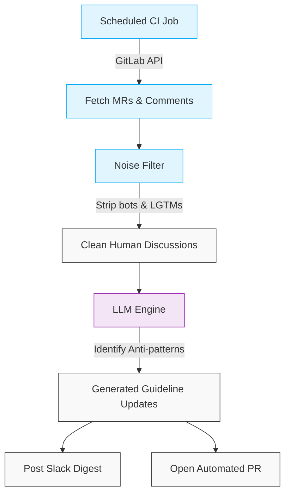

In every growing engineering organization, technical documentation is almost always out of date. We write extensive "Engineering Guidelines" covering everything from Jetpack Compose state management to Kotlin Coroutine scoping. Yet, developers still make the same mistakes, and senior engineers spend countless hours repeatedly pointing out the exact same architectural violations in Merge Requests.

We realized that our engineering guidelines were static, but our code was dynamic. We needed a system that learned from our daily mistakes and updated our standards automatically. 

We needed a **Self-Healing Engineering Culture**. 

Instead of relying on AI just to write code faster (like GitHub Copilot), we built a system that uses AI to analyze human behavior, eliminate organizational friction, and institutionalize knowledge. Here is how we architected a fully automated "Monthly Guideline Generator" using GitLab CI and Large Language Models (LLMs).

## The Architecture

The goal of this system is to ingest a month's worth of code review discussions, identify recurring anti-patterns, and automatically open a Pull Request against our internal wiki proposing new rules to prevent those mistakes.

### 1. Data Ingestion (The Pipeline)

We set up a scheduled GitLab CI pipeline that runs on the first day of every month. A Python script hits the GitLab API to fetch every Merge Request merged within the last 30 days across our mobile repositories. 

Crucially, it traverses the API to pull down every single discussion thread and comment made on those MRs. 

### 2. Noise Filtering

A raw dump of MR comments is incredibly noisy. If you feed the raw data to an LLM, it will get distracted by system logs. 

Our script filters out the noise before the AI ever sees it. We strip out:
* Automated CI bot comments (e.g., SonarQube quality gate statuses).
* System messages (e.g., "Assignee changed", "Approved").
* Short boilerplate replies (e.g., "LGTM", "Done", "Fixed").

What remains is a dense dataset of purely human-to-human technical code review discussions.

### 3. The LLM Analysis Engine

We take this filtered text dump and feed it into an LLM with a massive context window (like Gemini 1.5 Pro). We use a highly specific system prompt to guide the analysis:

> *"You are a Principal Android Engineer. Below are the code review discussions from our team over the last 30 days. Identify the top 3 recurring anti-patterns across Android Architecture, Jetpack Compose, Unit Testing, and Kotlin style.*
>
> *For each anti-pattern, explain what went wrong, and write a new, formal paragraph to be added to our `engineering-guidelines.md` document to prevent this mistake in the future."*

Because the LLM is reading the actual conversations between our senior and junior developers, it doesn't output generic Android advice. It identifies exactly what *our specific team* is struggling with—whether that's leaking ViewModel scopes or misusing `remember` in Compose.

### 4. Closing the Loop: The Automated PR

Printing a report to a console isn't enough. We built the script to take autonomous action.

Once the LLM generates the proposed guideline updates, the pipeline automatically:
1. **Posts a Slack Digest:** It sends a summary to the `#android-engineers` channel. *"Hey team, this month we spent 45 comments correcting Compose Recomposition logic. Let's focus on state hoisting this sprint!"*
2. **Opens an Automated PR:** The script uses the GitLab API to check out a new branch on our documentation repository, appends the LLM's proposed rules to `engineering-guidelines.md`, and opens a Merge Request.

## The Impact

This workflow completely changed how we handle technical debt and onboarding. 

Our documentation is no longer a graveyard of outdated opinions; it is a living document that reacts to the actual mistakes our engineers are making in real-time. A Staff Engineer simply reviews the automated PR, tweaks the LLM's wording if necessary, and clicks "Merge." 

By leveraging AI in the Software Development Life Cycle (SDLC) to analyze human reviews, we didn't just speed up our coding—we automated the institutionalization of knowledge.
